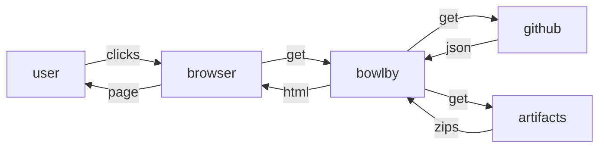

# test

A suite of integration tests that can exercise various subsets of the system components.

The complete system looks like this:

```mermaid
flowchart LR
  user --clicks--> browser
  browser --page--> user
  browser --get--> bowlby
  bowlby --html--> browser
  bowlby --get--> github
  github --json--> bowlby
  bowlby --get--> artifacts
  artifacts --zips--> bowlby
```
