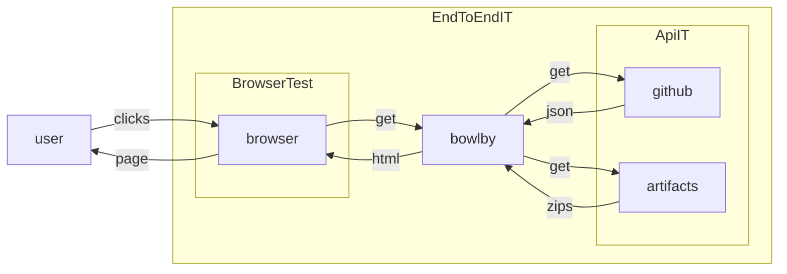

# test

A suite of integration tests that can exercise various subsets of the system components.

The module contains three tests:



## `BrowserTest`

```
mvn test -pl test -am -Dtest=BrowserTest
```

Exercises the browser in isolation, confirming that it produces the HTTP requests that we
expect in response to UI interactions.


## `ApiIT`

```
BOWLBY_GH_AUTH_TOKEN=<api token value> mvn verify -pl test -am -Dit.test=ApiIT
```

Exercises the github API in isolation, confirming that it responds as we expect it to.

## `EndToEndIT`

```
BOWLBY_GH_AUTH_TOKEN=<api token value> mvn verify -pl test -am -Dit.test=EndToEndIT
```

Stands up an instance of bowlby and exercises the complete system
